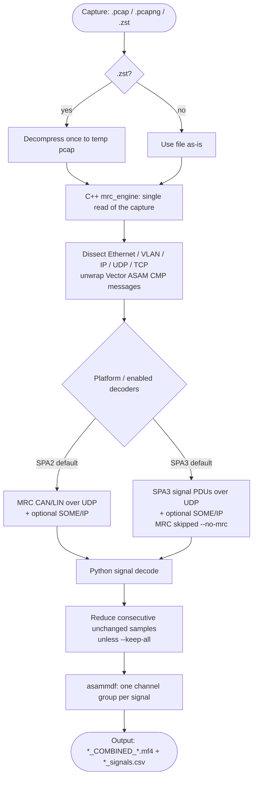
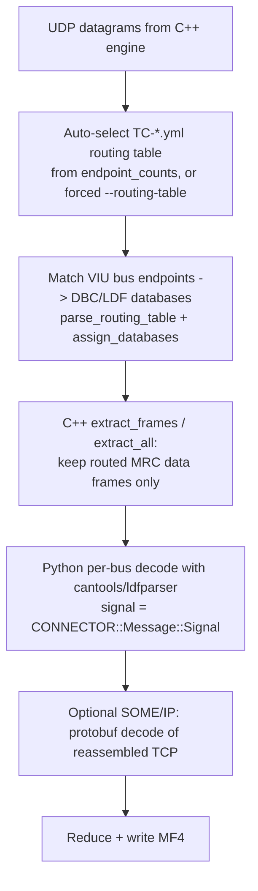
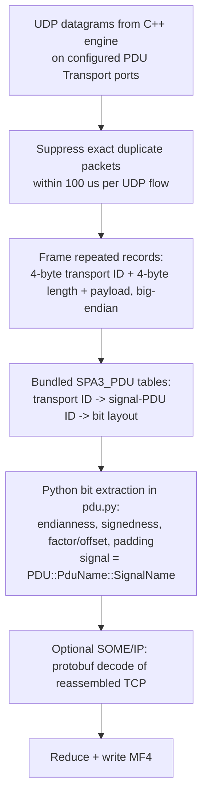
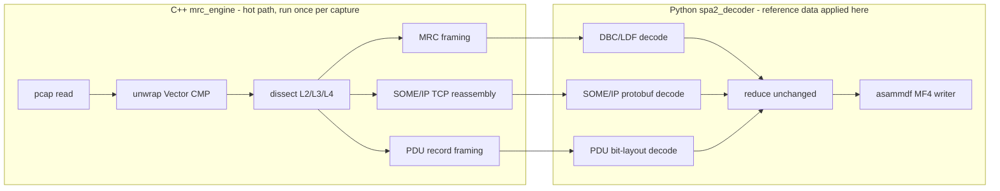

# PCAP → MF4 workflow (SPA2 and SPA3)

This decoder splits work between a C++ engine and a Python layer:

- **C++ (`mrc_engine`)** — reads the capture once and does all packet work:
  Ethernet/VLAN/IP/UDP/TCP dissection, Vector ASAM CMP unwrapping, MRC framing,
  SOME/IP TCP reassembly, and SPA3 PDU record framing. It returns compact numpy
  arrays and knows **no** signal names.
- **Python (`spa2_decoder`)** — turns those raw arrays into named, scaled signals
  using the SDB databases (MRC), protobuf definitions (SOME/IP), and the generated
  layout tables (PDU), then reduces unchanged samples and writes the MF4.

The C++ engine is reused unchanged for both platforms; only which decoders run and
which reference data is applied differs.

## High-level flow



## SPA2 path (MRC CAN/LIN)



Inputs required: SDB `db/` directory and `manifest.yaml` (SPA2 / `p519`).

## SPA3 path (signal PDUs)



Inputs required: the four generated files under `SPA3_PDU/`
(`Signal_PDU_identifiers_ETH`, `Signal_PDU_Binding_PDU_Transport_ETH`,
`Signal_PDU_signal_list_ETH`, `decode_as_entries`). These are a reference
snapshot and are **not** selected or updated by downloading a GPA SDB; use a
matching version via `--pdu-config` (or the UI's PDU configuration directory).
SPA2 routing tables and DBC/LDF databases are **not** needed for PDU-only decoding.

## Where C++ ends and Python begins



The reference `nuc-logger` instead **generates C decoder functions** from the
databases and compiles them with `make` for every SDB/PDU version, so its decode
is fully in C++. This repo keeps the signal decode in Python to avoid a per-version
codegen + recompile step; the compiled engine is only rebuilt when the engine
source itself changes:

```bash
cmake --build mrc_decoder/build --target mrc_engine -j2
```
